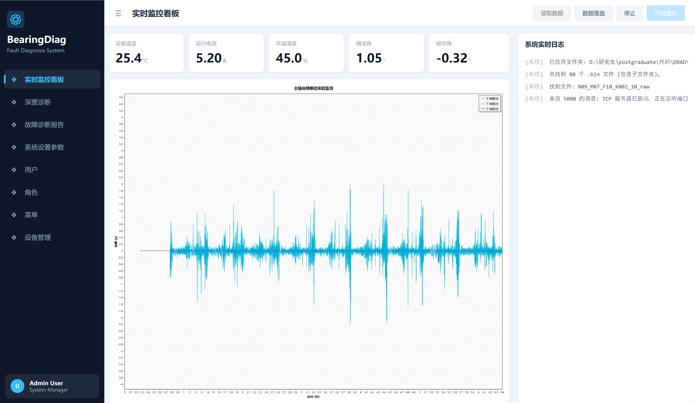
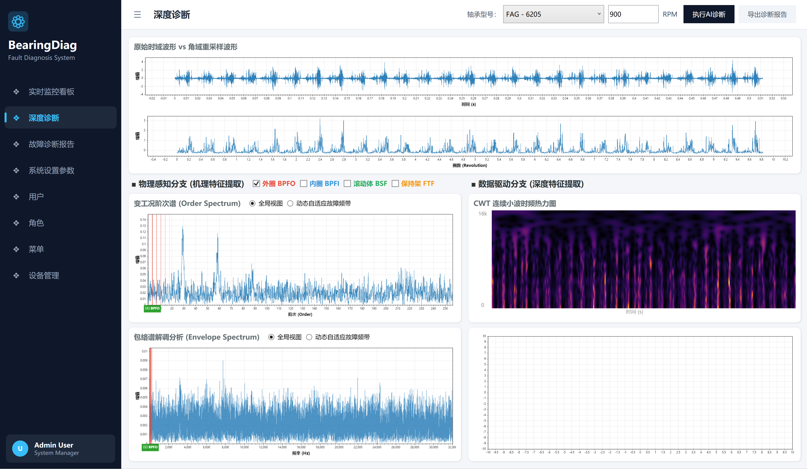

# 工业轴承故障智能诊断与预测性维护系统

这是一个基于 .NET 8 构建的高性能跨平台设备健康监测上位机系统。通过采集并分析工业设备的高频振动数据，实现对设备早期故障的准确诊断与预测性维护，降低因设备意外停机带来的经济损失。

## 技术栈

`C#` | `WPF` | `C++` | `.NET 8` | `CommunityToolkit.Mvvm` | `Socket` | `ScottPlot` | `P/Invoke` | `FFTW` | `ONNX Runtime`

## 项目价值与参考意义

本项目为 C#/.NET 开发者及工业互联网（IIoT）相关从业者提供以下技术实践参考：

- **性能优化实践**：展示通过 `P/Invoke`、`unsafe` 内存锁定（Pinning）以及 `Span<T>` 等现代 C# 特性，在一定程度上降低常驻内存开销，实现托管与非托管代码间的高效数据传递。
- **高频数据流治理**：通过原生 `TCP Socket` 异步模型，结合**生产者-消费者并发模型（ConcurrentQueue + Channel）**，探讨如何有效缓解高采样率环境下的界面响应延迟与内存积压问题。
- **客户端架构设计**：提供基于 `.NET 8` 泛型主机（Generic Host）与 `MVVM` 模式构建桌面端应用的代码骨架，涵盖基础的依赖注入与组件生命周期管理。
- **跨领域技术整合**：梳理软件工程实施与基础数字信号处理（如 DSP、FFT 算法）的结合流程，为设备健康管理（PHM）上位机系统的开发提供一条可供验证的实现路径。

## 界面概览

### 1. 主界面


### 2. 深度诊断


## 核心特性

- **企业级应用架构：** 基于 **.NET 8** 搭建跨平台 **MVVM** 客户端，并引入了泛型主机架构实现全局服务依赖注入与对象生命周期管理。
- **双模数据接入机制：** 支持实时与离线两种数据流模式。一方面可利用原生的下位机高速通信接收实时振动数据流进行监控；另一方面支持直接解析加载本地已保存的 `.mat` 格式历史数据，方便复盘和算法对照分析。
- **高性能数据采集：** 基于原生 **TCP Socket** 封装异步通信模块，引入**生产者-消费者**并发模型与 `ConcurrentQueue` 线程安全队列，可以安全稳定地处理每秒 2000 次的高频振动数据流。[深入了解 ConcurrentQueue 与无锁并发提取实现细节](TechnicalDetails.md)
- **跨语言零拷贝计算优化：** 针对密集型计算场景设计了专用的 C++ 高性能计算模块。将 FFT（快速傅里叶变换）、阶次跟踪 (Order Tracking) 等核心算法采用 C++ 封装为动态链接库 (DLL)；通过 **P/Invoke** 实现 C# 与 C++ 数组之间的**零拷贝内存交互**，极大地避免了大量浮点数据在托管与非托管内存切换时引发的垃圾回收开销，显著提升了实时流数据的处理速度与系统吞吐量。[深入了解 P/Invoke 与跨语言零拷贝实现细节](TechnicalDetails.md)
- **CWT 连续小波时频热力图：** 基于 Morlet 小波频域卷积的 CWT 算法，通过 FFTW 加速实现 128 个对数频率尺度 × 512 时间点的时频能量矩阵计算。采用 WPF 原生 WriteableBitmap 直接像素渲染，结合 Inferno 色图映射，直观展示振动信号的能量分布。[深入了解 CWT 热力图实现细节](TechnicalDetails.md)
- **AI 智能诊断：** 集成 ONNX Runtime 推理引擎，并行部署多个故障诊断模型，基于多模型集成策略输出故障类别置信度，辅助运维人员进行设备状态评估。


## 项目结构说明

本仓库采用多项目解决方案（包含 C# 前端及业务层与 C++ 算法层）：

```text
 ┣ 📁 Behaviors       # 存放附加行为（Attached Behaviors）
 ┣ 📁 Controls        # 存放自定义控件（Custom Controls）或复用的 UserControl
 ┣ 📁 Converters      # 存放各种数据绑定转换器（IValueConverter / IMultiValueConverter）
 ┣ 📁 Core            # 核心基础类（如：中介者、基类、全局配置、常量等）
 ┣ 📁 Extensions      # 存放 C# 扩展方法
 ┣ 📁 HighPerformanceComputing # C++ 核心算法工程（负责 DSP、FFT 信号隔离计算与 DLL 导出）
 ┣ 📁 Models          # 存放数据模型、实体类、DTO 等
 ┣ 📁 Resources       # 存放静态资源(包含文字、图表、全局样式等)
 ┣ 📁 Services        # 存放业务服务、数据访问服务、通信等
 ┃  ┣ 📁 Interfaces   # 服务接口定义（如 ISensorDataService）
 ┃  ┗ 📁 Implements   # 服务接口实现 (依赖注入)
 ┣ 📁 ViewModels      # 存放视图模型类（包含业务逻辑和 UI 状态）
 ┣ 📁 Views           # 存放所有的 UI 视图
 ┃  ┣ 📁 Windows      # 存放独立的 Window
 ┃  ┗ 📁 Pages        # 存放页面（基于 Navigation）
 ┣ 📄 App.xaml        # 应用程序入口及资源引入
 ┗ 📄 MainWindow.xaml # 主窗体
```

## 快速启动

1. 确保已安装好 **.NET 8 SDK** 以及支持 **C++ 桌面开发工作负载**（MSVC、C++ CMake 等）的 Visual Studio。
2. 使用 `git clone https://github.com/dream-one/Bearing-Fault-Diagnosis.git` 将项目克隆至本地。
3. 双击 `BearingFaultDiagnosis.sln` 打开项目。
4. 编译时，Visual Studio 会自动按工程依赖顺序，先编译 `HighPerformanceComputing` 项目生成 DLL，再编译 C# 主程序。
5. 在需要的情况下还原 NuGet 依赖。
6. 点击上方「启动」编译并运行此上位机系统应用程序。

---

## AI 智能诊断

本项目在深度诊断页面（DeepDiagnosis）中集成了基于 **ONNX Runtime** 的 AI 推理引擎，通过并行部署四个 ONNX 模型进行集成推理，实现对轴承故障状态的智能分类与置信度评估。模型推理结果以柱状图形式实时展示在诊断界面，辅助运维人员进行设备状态判断。

当前分类标签包括：正常状态、内圈早期损伤、外圈早期损伤。

---

## 待办规划

### 短期

1. **轴承参数管理页面** - 增加自定义修改轴承参数（几何尺寸、故障频率系数等）的配置页面，支持增删改查。
2. **AI 诊断与图表联动** - 完善诊断结果与频谱图表的交互联动，点击概率柱状图可定位到对应故障频率区域。

### 长期

1. **健康因子与寿命预测** - 引入基于回归模型或时间序列模型（如 LSTM、Transformer、卡尔曼滤波退化模型），计算设备的健康因子 (Health Indicator, HI) 和剩余使用寿命 (Remaining Useful Life, RUL)，并用趋势曲线展示设备退化轨迹。
2. **多维度越限报警系统** - 基于 ISO 10816 等国际标准的振动烈度报警阈值设置，结合看板上的温度、电流等参数实现多维度越限报警。在界面右上角增加报警消息中心，并可扩展邮件/企业微信/钉钉的 Webhook 推送。
3. **特征趋势与 3D 频谱瀑布图** - 增加页面展示过去一周/一月的特征参数（RMS、峰值、峭度等）趋势线。引入 3D 瀑布图或彩图 (Color Map) 展示频谱随时间的变化（时间-频率-幅值），便于观察频率成分的演化过程。
4. **标准工业协议支持** - 支持 OPC UA、Modbus TCP 等标准工业通信协议，便于与 PLC、DCS 等系统集成。
5. **报告自动生成** - 一键生成包含图表截图、频域分析结论、AI 诊断置信度结果的 PDF 报告。
6. **插件化架构** - 支持以插件形式动态加载 AI 模型或信号处理算法，无需修改主程序代码即可扩展功能。
7. **边缘与云端协同** - 实现边缘端实时采集与推理、云端历史数据存储与模型迭代的协同架构。

---

## 开源协议

本项目基于 MIT 协议开源，详见 [LICENSE](LICENSE) 文件。

---

如果遇到使用上的问题，欢迎在 GitHub 提交 Issue。
